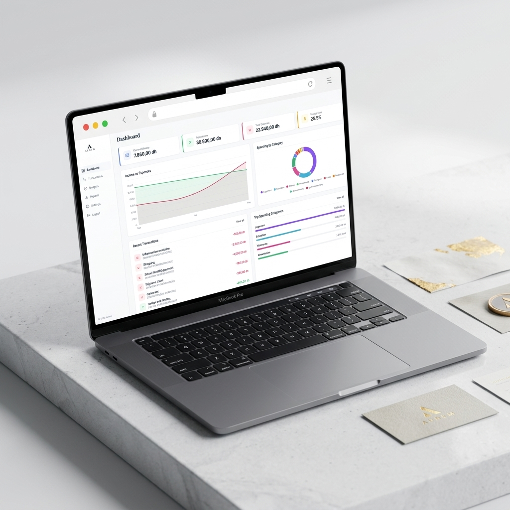
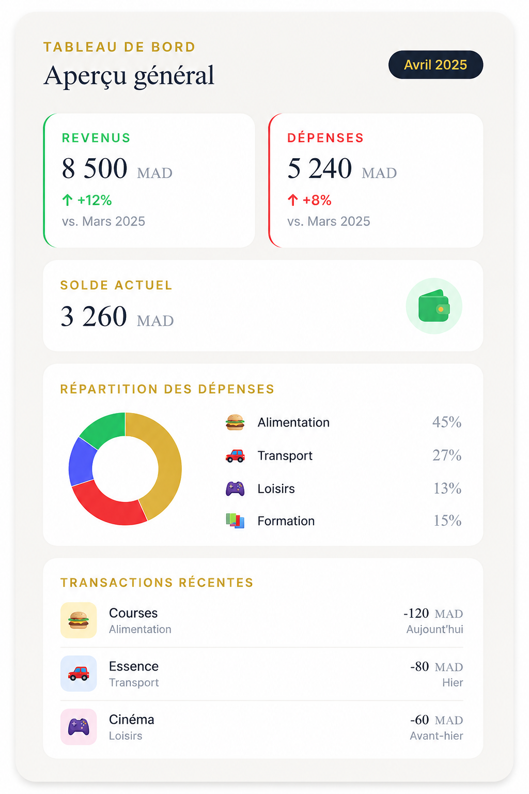
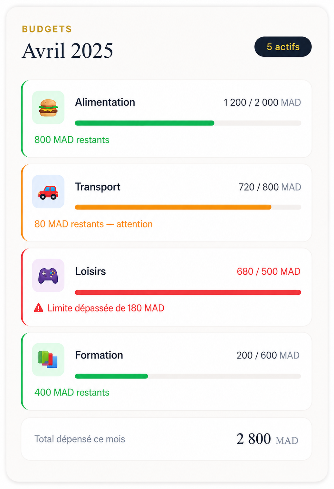
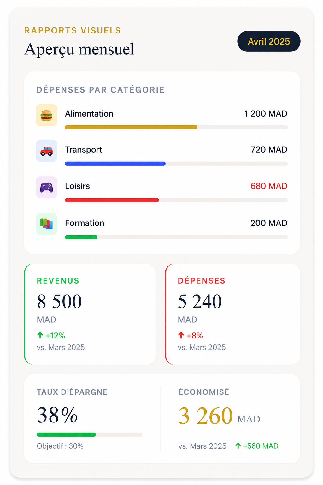
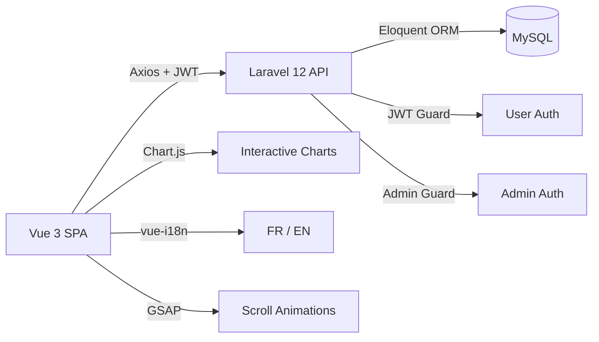

<p align="center">
  
</p>

<p align="center">
  <strong>Personal Finance Manager — Full-Stack Web Application</strong><br/>
  <em>Track income & expenses · Set smart budgets · Visualize spending with interactive reports</em>
</p>

<p align="center">
  
  
  
  
  
  
</p>

<p align="center">
  
  
  
</p>

---

## 📸 Preview

<p align="center">
  
</p>

<p align="center">
  
  
  
</p>

---

## ✨ Highlights

| What makes Aurem stand out |  |
|---|---|
| 🏗️ **Full-Stack Architecture** | Decoupled SPA (Vue 3) + RESTful API (Laravel 12) with JWT authentication |
| 🎨 **Premium UI/UX** | GSAP scroll animations, glassmorphism effects, responsive design, and custom branding |
| 👤 **Dual Auth System** | Separate user & admin authentication guards with isolated JWT sessions |
| 🌍 **Bilingual** | Complete French & English support via `vue-i18n` |
| 📊 **Interactive Charts** | Doughnut & line charts powered by Chart.js for real-time financial insights |
| 💰 **Moroccan Dirham** | Professional MAD currency formatting throughout the app |
| 🛡️ **Admin Panel** | Full platform management — user control, audit logs, maintenance mode |

---

## 🚀 Features

### 👤 User Dashboard

- **Real-time overview** — Balance, monthly income/expenses, savings rate
- **Trend charts** — Income vs. expenses over the last 6 months (line chart)
- **Spending breakdown** — Category-based doughnut chart with interactive legend
- **Recent transactions** — Quick access to latest financial activity

### 💸 Transaction Management

- Add income & expenses with **live money formatting** (e.g. `13 334 000,00 MAD`)
- **Floating category selector** with emoji icons and color coding
- Sortable transaction table with delete confirmation modals

### 🎯 Smart Budgets

- Month/year picker for any period
- Auto-fetch expenses from backend for selected month
- **Color-coded progress bars** — green → amber → red based on spending
- Summary strip: total budget / spent / remaining

### 📈 Visual Reports

- 6-month trend line chart (income vs. expenses)
- Category spending breakdown with totals
- Filterable by period

### 🏷️ Custom Categories

- Create, edit, delete categories with emoji icons + color pickers
- System defaults synced per user and protected from deletion

### ⚙️ Settings & i18n

- Profile management (name, email, password)
- Full **French / English** toggle

---

### 🔐 Admin Panel (`/admin`)

| Feature | Description |
|---|---|
| **Dashboard** | Platform-wide stats: total users, transactions, income/expense, registration trends |
| **User Management** | Search, view profiles, deactivate/reactivate, or delete accounts |
| **Transaction Feed** | Global feed with filters (type, category, month, year) + server-side pagination |
| **Category Management** | System default categories (CRUD) + user custom categories grouped by user |
| **Audit Log** | Timestamped record of all admin actions |
| **System Settings** | Maintenance mode toggle, application cache clearing |

---

## 🛠️ Tech Stack

### Frontend

| Technology | Version | Role |
|:---|:---:|:---|
|  | `3.5` | Composition API with `<script setup>` |
|  | `8.x` | Build tool & dev server |
|  | `5.x` | Client-side routing with navigation guards |
|  | `11.x` | Internationalization (FR / EN) |
|  | `4.x` | Interactive charts (doughnut, line) |
|  | `1.x` | HTTP client with JWT interceptor |

### Backend

| Technology | Version | Role |
|:---|:---:|:---|
|  | `8.2+` | Runtime |
|  | `12.x` | RESTful API framework |
|  | `latest` | Dual authentication (user + admin) |
|  | `8.x` | Relational database |

---

## 📂 Project Structure

```
Aurem/
├── 📁 backend/                        # Laravel 12 RESTful API
│   ├── app/
│   │   ├── Http/Controllers/Api/
│   │   │   ├── AuthController         # Register, login, logout, profile
│   │   │   ├── AdminAuthController    # Admin JWT auth (separate guard)
│   │   │   ├── AdminController        # Dashboard, users, transactions, logs, settings
│   │   │   ├── CategoryController     # User CRUD categories
│   │   │   ├── DashboardController    # Aggregated user stats
│   │   │   ├── ExpenseController      # Expense CRUD + month/year filtering
│   │   │   └── IncomeController       # Income CRUD
│   │   ├── Middleware/
│   │   │   └── CheckMaintenanceMode   # Blocks user requests during maintenance
│   │   └── Models/                    # User, Admin, Category, Income, Expense, etc.
│   ├── database/
│   │   ├── migrations/                # 12 migration files
│   │   └── seeders/                   # Default categories, demo data
│   └── routes/
│       └── api.php                    # All API route definitions
│
├── 📁 frontend/                       # Vue 3 Single Page Application
│   ├── src/
│   │   ├── views/
│   │   │   ├── LandingView            # Animated public landing page
│   │   │   ├── DashboardView          # User financial dashboard
│   │   │   ├── TransactionsView       # Income & expense management
│   │   │   ├── BudgetsView            # Monthly budget planner
│   │   │   ├── ReportsView            # Charts & financial reports
│   │   │   ├── SettingsView           # Profile settings
│   │   │   └── admin/                 # 7 admin views (dashboard, users, etc.)
│   │   ├── components/
│   │   │   └── AppLayout              # Authenticated sidebar layout
│   │   ├── router/                    # Routes + navigation guards
│   │   ├── services/                  # Axios instance + JWT interceptor
│   │   ├── i18n/                      # FR & EN translation files
│   │   └── style.css                  # Global design system
│   └── package.json
│
├── 📁 ressources/                     # Design assets & mockups
└── 📄 README.md
```

---

## ⚡ Quick Start

### Prerequisites

- **PHP** ≥ 8.2 &nbsp;·&nbsp; **Composer** ≥ 2.x &nbsp;·&nbsp; **Node.js** ≥ 18.x &nbsp;·&nbsp; **MySQL** 8.x

### 1️⃣ Clone & Setup Backend

```bash
git clone https://github.com/Zouhair-sS/Aurem.git
cd Aurem/backend

composer install
cp .env.example .env
php artisan key:generate
php artisan jwt:secret
```

Configure `.env` with your database credentials:

```env
DB_CONNECTION=mysql
DB_HOST=127.0.0.1
DB_PORT=3306
DB_DATABASE=aurem
DB_USERNAME=root
DB_PASSWORD=

ADMIN_NAME=Admin
ADMIN_EMAIL=admin@aurem.com
ADMIN_PASSWORD=password
```

```bash
php artisan migrate
php artisan db:seed
```

### 2️⃣ Setup Frontend

```bash
cd ../frontend
npm install
```

### 3️⃣ Run

```bash
# Terminal 1 — Backend
cd backend && php artisan serve          # → http://localhost:8000

# Terminal 2 — Frontend
cd frontend && npm run dev               # → http://localhost:5173
```

---

## 🔑 Default Accounts

| Role | Email | Password |
|:---:|:---|:---|
| 👤 **User** | `test@example.com` | `password` |
| 🔐 **Admin** | `admin@aurem.com` | `password` |

> Admin login is available at `/admin/login`

---

## 🌐 API Reference

<details>
<summary><strong>Authentication</strong> — <code>/api/auth</code></summary>

| Method | Endpoint | Description |
|:---:|:---|:---|
| `POST` | `/auth/register` | Register a new user |
| `POST` | `/auth/login` | Login & receive JWT |
| `POST` | `/auth/logout` | Revoke token |
| `GET` | `/auth/me` | Current user profile |
| `PUT` | `/auth/profile` | Update profile |

</details>

<details>
<summary><strong>User Resources</strong> — <code>/api</code></summary>

| Method | Endpoint | Description |
|:---:|:---|:---|
| `GET` | `/dashboard` | Dashboard stats & charts |
| `GET/POST` | `/categories` | List / create categories |
| `PATCH/DELETE` | `/categories/{id}` | Update / delete category |
| `GET/POST` | `/expenses` | List (filterable) / create expenses |
| `DELETE` | `/expenses/{id}` | Delete expense |
| `GET/POST` | `/incomes` | List / create incomes |
| `DELETE` | `/incomes/{id}` | Delete income |

</details>

<details>
<summary><strong>Admin Panel</strong> — <code>/api/admin</code></summary>

| Method | Endpoint | Description |
|:---:|:---|:---|
| `POST` | `/admin/login` | Admin login |
| `POST` | `/admin/logout` | Admin logout |
| `GET` | `/admin/me` | Admin profile |
| `GET` | `/admin/dashboard` | Platform-wide stats |
| `GET` | `/admin/users` | List users (with search) |
| `GET` | `/admin/users/{id}` | View user details |
| `PATCH` | `/admin/users/{id}/deactivate` | Deactivate user |
| `PATCH` | `/admin/users/{id}/reactivate` | Reactivate user |
| `DELETE` | `/admin/users/{id}` | Delete user |
| `GET` | `/admin/transactions` | Global feed with filters |
| `GET/POST` | `/admin/categories` | System categories CRUD |
| `PATCH/DELETE` | `/admin/categories/{id}` | Update / delete system category |
| `GET` | `/admin/user-categories` | User-created categories |
| `DELETE` | `/admin/user-categories/{id}` | Delete user category |
| `GET` | `/admin/logs` | Audit log |
| `GET/PATCH` | `/admin/settings` | System settings |
| `POST` | `/admin/settings/clear-cache` | Clear app cache |

</details>

---

## 🏗️ Architecture



---

## 🧠 Key Technical Decisions

| Decision | Rationale |
|---|---|
| **Separate JWT guards** | User and admin sessions are fully isolated — compromising one doesn't affect the other |
| **Composition API (`<script setup>`)** | Cleaner, more concise component logic with better TypeScript readiness |
| **GSAP + ScrollTrigger** | Scroll-driven animations on the landing page for a premium, recruiter-worthy first impression |
| **IntersectionObserver for video** | Demo video auto-plays when scrolled into view — no wasted bandwidth |
| **localStorage for budgets** | Budget limits are client-side per month, keeping the backend stateless for budget config |
| **System vs. user categories** | Seedable defaults + full user customization without data conflicts |

---

## 👥 Team

| Member | Role |
|---|---|
| **Zouhair** | Full-Stack Developer |

> 🎓 Academic project — **EMSI Casablanca** · IIR · 3rd Year · 2025/2026

---

## 📄 License

This project was developed as a **Projet de Recherche Scientifique** (Scientific Research Project) at EMSI Casablanca. It is intended for academic and portfolio purposes.

---

<p align="center">
  
  <br/>
  <sub><strong>Aurem</strong> — Manage better. Live more.</sub>
</p>
